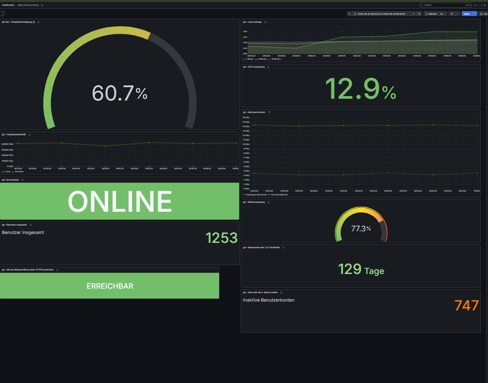
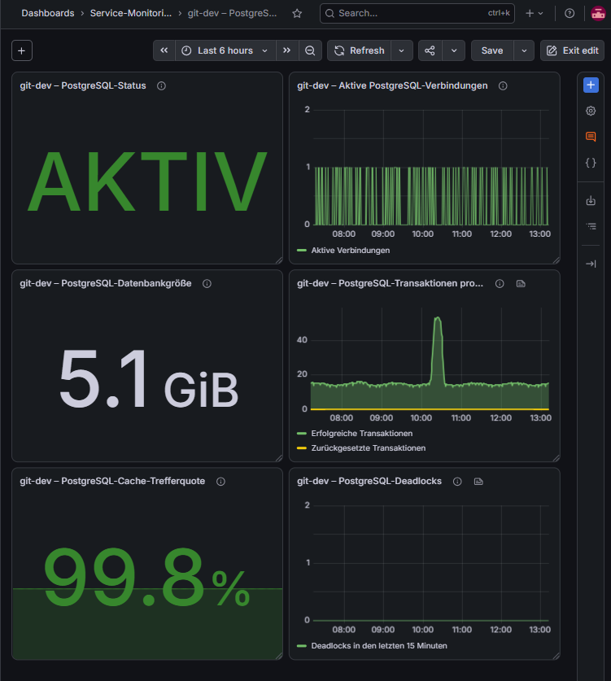
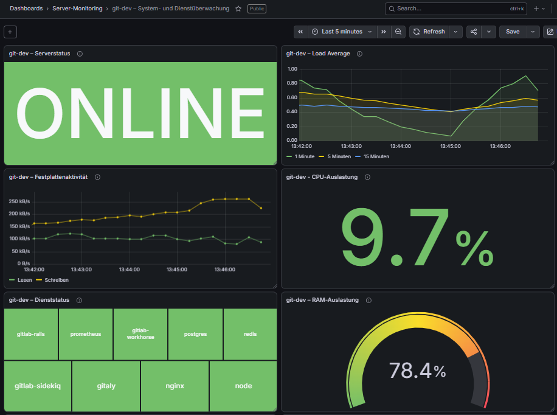
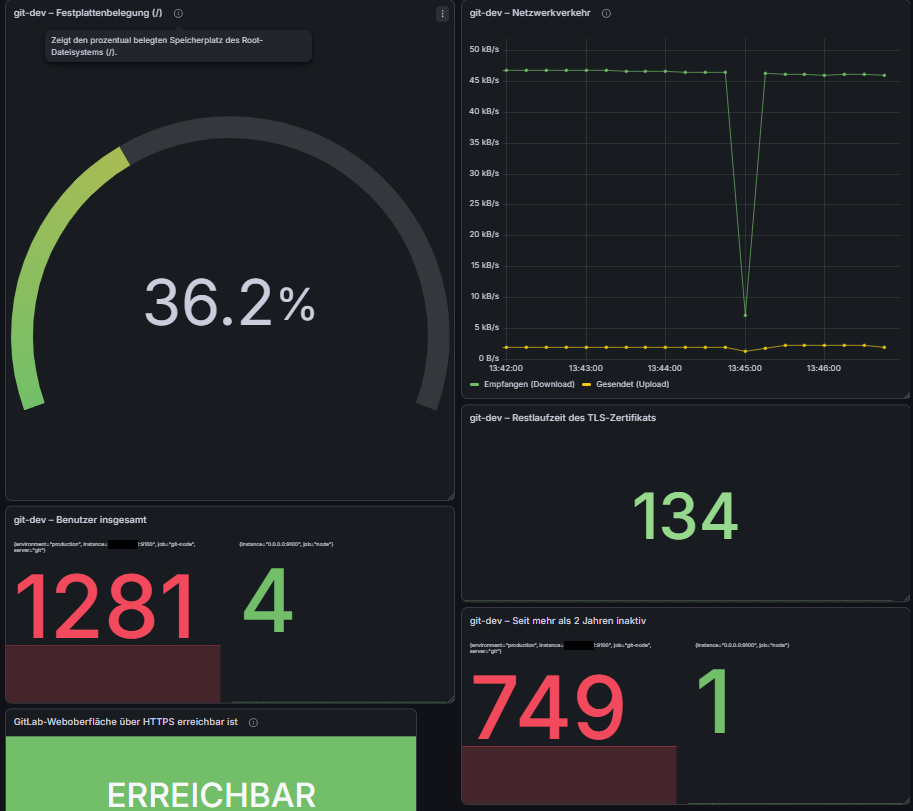
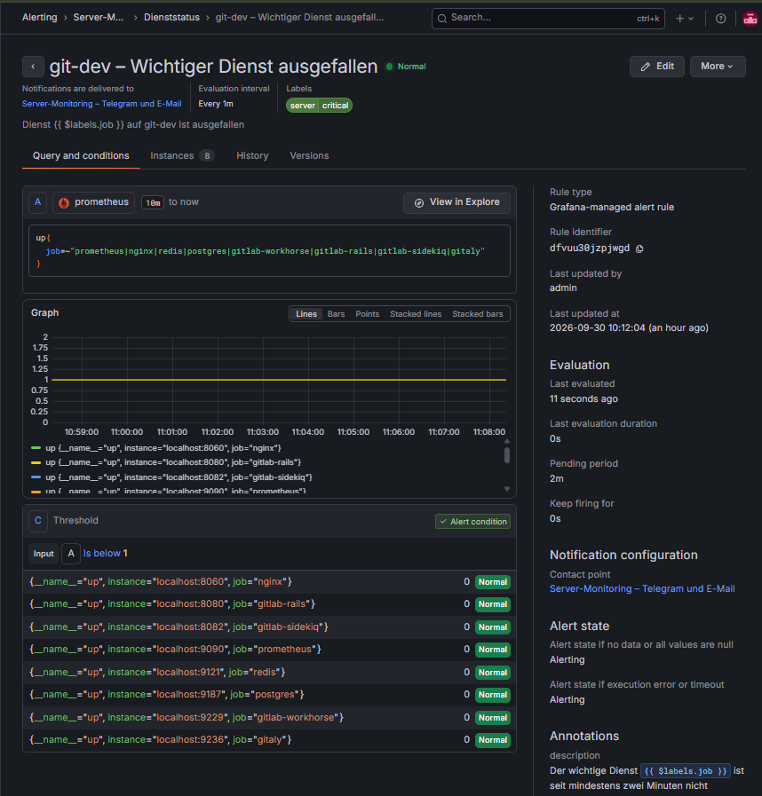
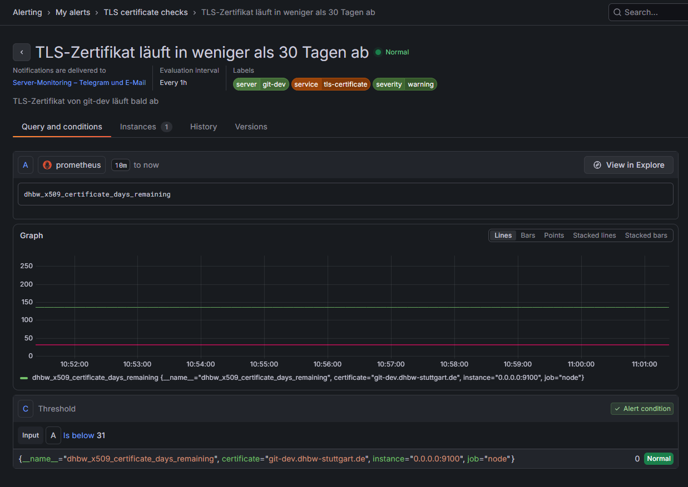
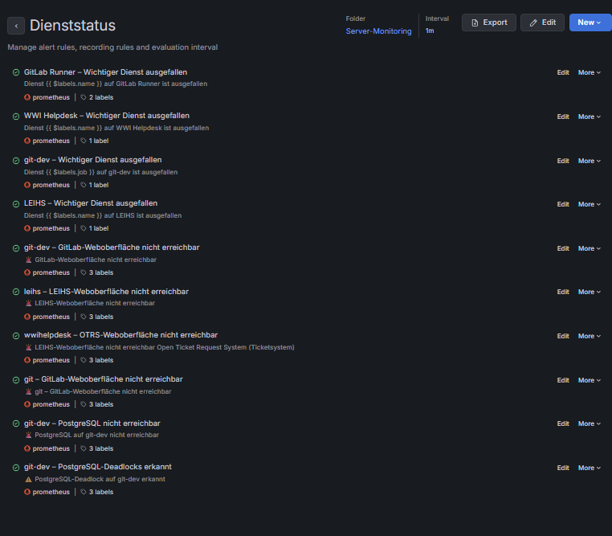

# Monitoring auf git-dev

## Aufgabe des Servers

`git-dev` ist der zentrale Monitoring-Server. Auf diesem Server laufen Prometheus, Grafana und der Blackbox Exporter.

Prometheus sammelt die Daten von den anderen virtuellen Maschinen. Grafana zeigt diese Daten in Dashboards an.

## 1. System prüfen

Zuerst wurden das Betriebssystem und die aktiven Monitoring-Dienste geprüft:

```bash
hostnamectl
gitlab-ctl status | grep -E 'prometheus|node-exporter|postgres-exporter'
ss -lntp | grep -E ':(3000|9090|9100|9115|9187)\b'
```

Wichtige Ports:

- `9090` – Prometheus
- `9100` – Node Exporter
- `9115` – Blackbox Exporter
- `9187` – PostgreSQL Exporter
- `3000` – Grafana, wenn Grafana diesen Port verwendet

## 2. Konfiguration sichern

Vor jeder Änderung wurde eine Sicherung erstellt:

```bash
cp -a /etc/gitlab/gitlab.rb \
  /etc/gitlab/gitlab.rb.backup-YYYY-MM-DD
```

Dadurch kann die alte Konfiguration bei einem Fehler wiederhergestellt werden.

## 3. Prometheus-Ziele eintragen

Die externen Server wurden in der Datei `/etc/gitlab/gitlab.rb` unter `prometheus['scrape_configs']` eingetragen.

Für Systemmetriken verwendet Prometheus den Node Exporter:

```text
<SERVER-IP>:9100
```

Für Webseiten und TLS-Zertifikate verwendet Prometheus den Blackbox Exporter:

```text
127.0.0.1:9115
```

Für jeden Server wurden eigene Jobs und Labels eingerichtet.

Dadurch können die Daten in Grafana eindeutig einem Server und einem Dienst zugeordnet werden.

Nach der Änderung wurde die Syntax geprüft:

```bash
/opt/gitlab/embedded/bin/ruby -c /etc/gitlab/gitlab.rb

```

Erwartetes Ergebnis: `Syntax OK`.

Danach wurde die Konfiguration übernommen:

```bash
gitlab-ctl reconfigure
```

## 4. Monitoring in Grafana prüfen

Prometheus sammelt die Messwerte der Server. In Grafana werden diese Werte als Dashboards angezeigt.



## 5. PostgreSQL überwachen

Auf `git-dev` werden auch Daten der PostgreSQL-Datenbank gesammelt. Das Dashboard zeigt den Zustand der Datenbank und wichtige Messwerte.



Die folgenden beiden Screenshots zeigen weitere PostgreSQL-Metriken:





## 6. Webseiten und TLS prüfen

Der Blackbox Exporter prüft die Webseiten über HTTPS. Prometheus speichert unter anderem, ob die Prüfung erfolgreich war (`probe_success`) und wann ein TLS-Zertifikat abläuft.

Für `git-dev` wird die GitLab-Weboberfläche geprüft. Auch die Webseiten von LEIHS und WWI Helpdesk wurden als eigene Ziele eingerichtet.
## 7. Alert-Regeln

Wenn der Server, die GitLab-Weboberfläche oder ein wichtiger Dienst nicht erreichbar ist, kann Grafana eine Warnung auslösen.





Auch für das TLS-Zertifikat und PostgreSQL gibt es Warnungen.





## Ergebnis

Prometheus sammelt die Messwerte zentral auf `git-dev`. Grafana zeigt den Zustand der Server, Webseiten und Datenbank an. Alert-Regeln melden wichtige Probleme.