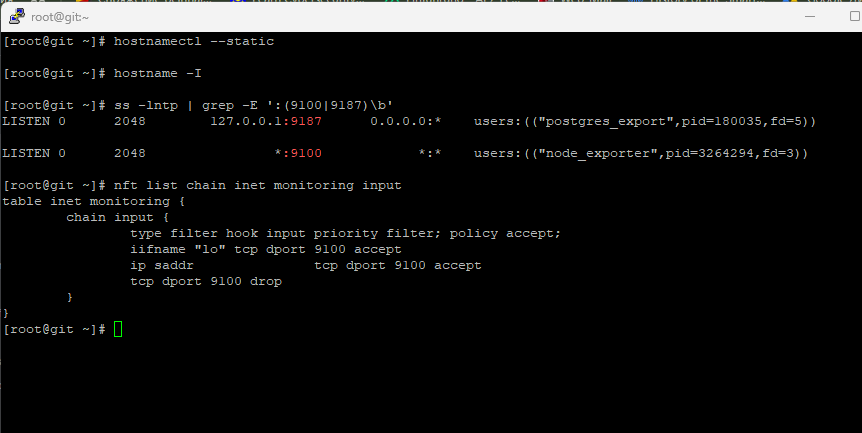
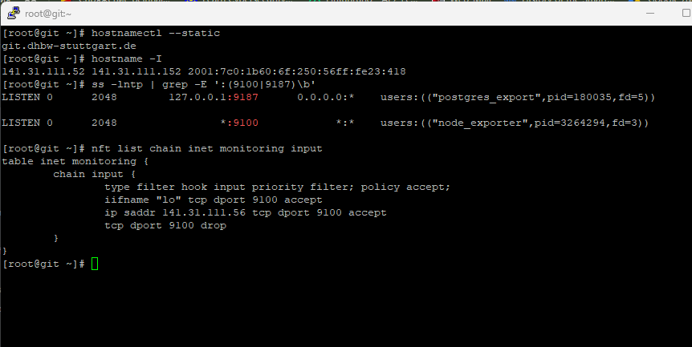
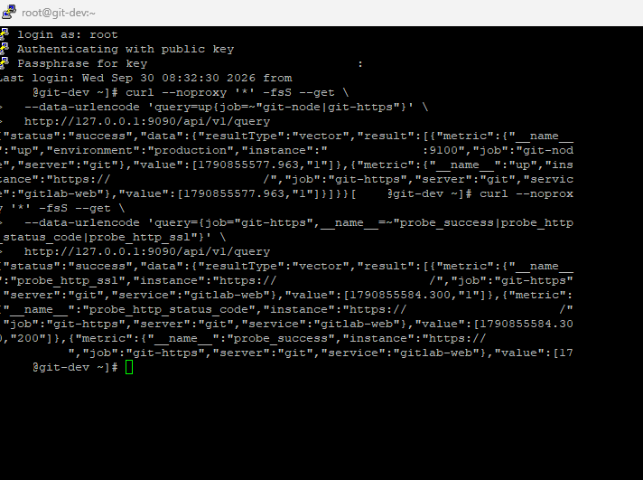
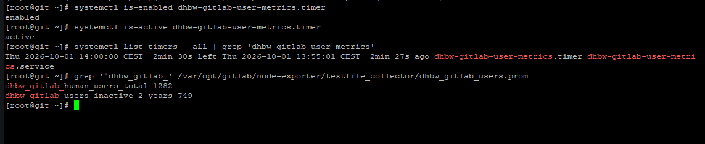
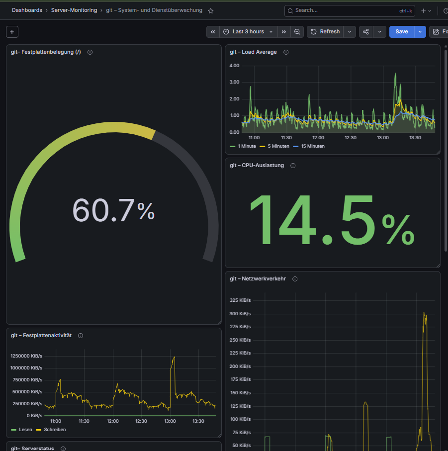
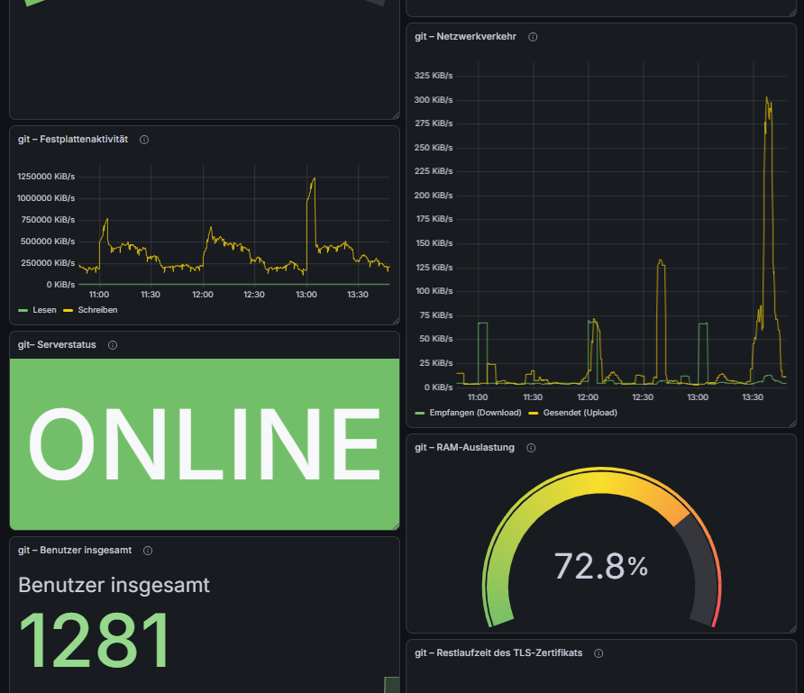
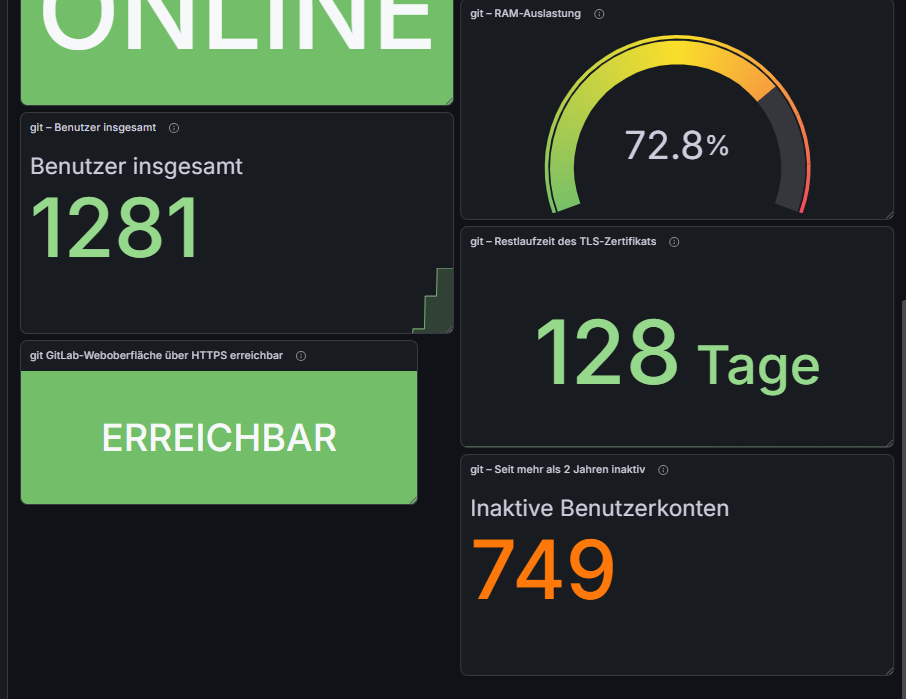
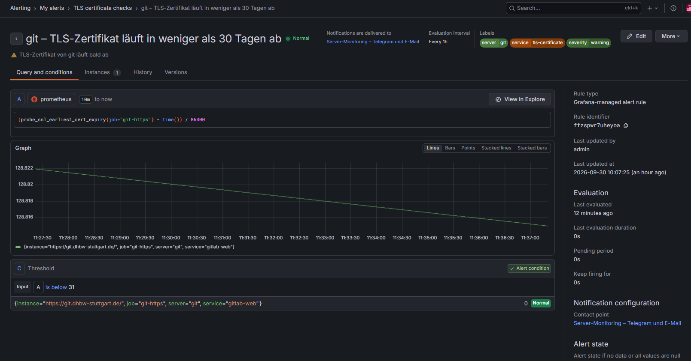

# Monitoring der VM git

## Aufgabe des Servers

Die VM `git` ist ein produktiver GitLab-Server. Für diesen Server wurden Systemdaten, die GitLab-Weboberfläche, das TLS-Zertifikat, PostgreSQL und GitLab-Benutzerkonten überwacht.

## 1. System und Netzwerk prüfen

Zuerst wurden das Betriebssystem, der Hostname und die IP-Adressen geprüft:

```bash
hostnamectl
hostname -I
```

Die Verbindung zum zentralen Monitoring-Server wurde ebenfalls geprüft:

```bash
getent hosts git-dev.example.com
ip route get <PROMETHEUS-IP>
```

Auf dem Server läuft Red Hat Enterprise Linux 8.10.

## 2. Vorhandene Monitoring-Dienste prüfen

GitLab enthält bereits mehrere Monitoring-Komponenten:

```bash
gitlab-ctl status | grep -E 'prometheus|node-exporter|postgres-exporter'
```

Die verwendeten Ports wurden geprüft:

```bash
ss -lntp | grep -E ':(9090|9100|9187)\b'
```

Dabei wurden folgende Dienste gefunden:

- Node Exporter auf Port `9100`
- PostgreSQL Exporter auf Port `9187`
- lokales Prometheus auf Port `9090`

## 3. GitLab-Konfiguration sichern

Vor der Änderung wurde eine Sicherung erstellt:

```bash
cp -a /etc/gitlab/gitlab.rb \
  /etc/gitlab/gitlab.rb.backup-YYYY-MM-DD
```

## 4. Node Exporter erreichbar machen

Der Node Exporter war zuerst nur lokal erreichbar. In `/etc/gitlab/gitlab.rb` wurde folgende Einstellung eingetragen:

```ruby
node_exporter['listen_address'] = '0.0.0.0:9100'
```

Danach wurde die Syntax geprüft:

```bash
/opt/gitlab/embedded/bin/ruby -c /etc/gitlab/gitlab.rb
```

Erwartetes Ergebnis:

```text
Syntax OK
```

Die neue Einstellung wurde übernommen:

```bash
gitlab-ctl reconfigure
```

Danach wurde der Port kontrolliert:

```bash
ss -lntp | grep ':9100'
```

## 5. Firewall für Port 9100

Der Port `9100` soll nicht für alle Systeme erreichbar sein. Nur der zentrale Prometheus-Server darf auf den Node Exporter zugreifen.

Dafür wurde mit `nftables` eine Regel eingerichtet:

```nft
table inet monitoring {
    chain input {
        type filter hook input priority filter; policy accept;

        iifname "lo" tcp dport 9100 accept
        ip saddr <PROMETHEUS-IP> tcp dport 9100 accept
        tcp dport 9100 drop
    }
}
```

Die Regeln wurden geprüft:

```bash
systemctl is-active nftables
systemctl is-enabled nftables
nft list ruleset
```

Erwartetes Ergebnis:

```text
active
enabled
```

### Screenshot der Firewall-Regel

Der Screenshot zeigt, dass der Zugriff auf Port `9100` nur für den Monitoring-Server erlaubt ist. Andere Verbindungen zu diesem Port werden blockiert.




## 6. Node Exporter testen

Der lokale Zugriff wurde so geprüft:

```bash
curl --noproxy '*' -fsS \
  http://127.0.0.1:9100/metrics | head
```

Danach wurde der Zugriff vom zentralen Monitoring-Server geprüft:

```bash
curl --noproxy '*' -fsS --connect-timeout 5 \
  http://<GIT-IP>:9100/metrics | head
```

Wenn Metriken angezeigt werden, funktioniert die Verbindung.

Die Meldung `curl: (23) Failed writing body` nach `head` ist in diesem Fall kein Fehler des Node Exporters. `head` beendet die Ausgabe nach den ersten Zeilen.

### Screenshot der Node-Exporter-Prüfung

Der Screenshot zeigt, dass der Node Exporter auf Port `9100` erreichbar ist und Systemmetriken bereitstellt.




## 7. Prometheus-Job einrichten

Auf `git-dev` wurde ein neuer Prometheus-Job eingerichtet:

```text
job_name: git-node
target: <GIT-IP>:9100
server: git
environment: production
```

Die Verbindung wurde mit Prometheus geprüft:

```promql
up{job="git-node"}
```

Das Ergebnis `1` bedeutet, dass Prometheus den Node Exporter erreicht.

### Screenshot der Prometheus-Prüfung

Der Screenshot zeigt, dass Prometheus die Metriken der VM `git` erfolgreich abruft. Der Wert `up = 1` bedeutet, dass das Ziel erreichbar ist.




## 8. HTTPS und TLS prüfen

Für die GitLab-Weboberfläche wurde ein Blackbox-Job eingerichtet:

```text
job_name: git-https
target: https://git.example.com/
server: git
service: gitlab-web
```

Folgende Metriken wurden geprüft:

```text
probe_success
probe_http_status_code
probe_http_ssl
probe_ssl_earliest_cert_expiry
```

Das Ergebnis war erfolgreich:

```text
probe_success = 1
probe_http_ssl = 1
```

### Screenshots der HTTPS- und TLS-Überwachung

Die GitLab-Weboberfläche ist über HTTPS erreichbar. Zusätzlich wird die verbleibende Laufzeit des TLS-Zertifikats angezeigt.


## 9. GitLab-Benutzermetriken

Für die Benutzerstatistik wurde ein eigenes Skript erstellt:

```text
/usr/local/sbin/custom-gitlab-user-metrics
```

Das Skript schreibt die Werte in eine Datei für den Node Exporter:

```text
/var/opt/gitlab/node-exporter/textfile_collector/custom_gitlab_users.prom
```

Erfasste Metriken:

```text
custom_gitlab_human_users_total
custom_gitlab_users_inactive_2_years
```

## 10. Automatische Aktualisierung

Das Skript wird automatisch durch einen systemd-Timer ausgeführt:

```text
custom-gitlab-user-metrics.service
custom-gitlab-user-metrics.timer
```

Der Status wurde geprüft:

```bash
systemctl is-enabled custom-gitlab-user-metrics.timer
systemctl is-active custom-gitlab-user-metrics.timer
systemctl list-timers --all | grep 'custom-gitlab-user-metrics'
```

Der Timer aktualisiert die Werte alle fünf Minuten.

### Screenshot des systemd-Timers

Der Screenshot zeigt, dass der Timer für die automatische Aktualisierung der GitLab-Benutzermetriken aktiv ist.




## 11. Grafana-Dashboard

Das Dashboard zeigt:

- Serverstatus
- CPU-Auslastung
- RAM-Auslastung
- Festplattenbelegung
- Festplattenaktivität
- Netzwerkverkehr
- Load Average
- GitLab-Weboberfläche
- Restlaufzeit des TLS-Zertifikats
- Benutzer insgesamt
- seit mehr als zwei Jahren inaktive Benutzerkonten

### Screenshots des Grafana-Dashboards

Die folgenden Screenshots zeigen die wichtigsten Systemmetriken der VM `git`.








## 12. Alert-Regeln

Für `git` wurden unter anderem folgende Alert-Regeln verwendet:

- Server nicht erreichbar
- GitLab-Weboberfläche nicht erreichbar
- wichtiger Dienst ausgefallen
- CPU-Auslastung hoch
- RAM-Auslastung hoch
- Festplatte fast voll
- TLS-Zertifikat läuft bald ab
- PostgreSQL nicht erreichbar
- PostgreSQL-Deadlock erkannt

### Screenshots der Alert-Regeln

Die folgenden Screenshots zeigen die eingerichteten Warnungen für die VM `git`.




## Ergebnis

Die VM `git` wird jetzt zentral durch Prometheus auf `git-dev` überwacht. Grafana zeigt die Systemdaten, den GitLab-Status, das Zertifikat, PostgreSQL und die Benutzerstatistik an.