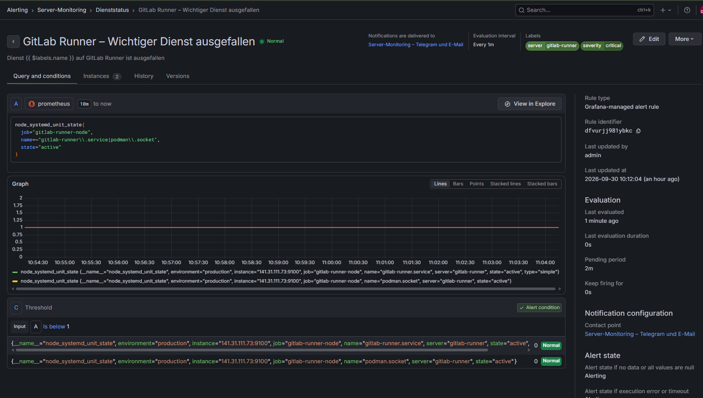

# Monitoring der VM GitLab Runner

## Aufgabe des Servers

Auf dieser VM laufen der GitLab Runner und die Podman API. Der GitLab Runner führt automatisierte CI/CD-Aufgaben aus. Podman wird für Container verwendet.

## 1. System prüfen

Zuerst wurden der Hostname, das Betriebssystem und die IP-Adresse geprüft:

```bash
hostnamectl
cat /etc/os-release
hostname -I
```

## 2. Dienste prüfen

Der Status des GitLab Runners wurde geprüft:

```bash
systemctl status gitlab-runner
```

Der Status der Podman API beziehungsweise des Podman-Sockets wurde ebenfalls geprüft:

```bash
systemctl status podman.socket
```

Die genauen Namen der Dienste können je nach Installation unterschiedlich sein.

## 3. Node Exporter prüfen

Der Node Exporter liefert die Systemmetriken an Prometheus.

Der Status wurde geprüft:

```bash
systemctl status node_exporter
```

Der verwendete Port wurde kontrolliert:

```bash
ss -lntp | grep ':9100'
```

## 4. Node Exporter lokal testen

Die Metriken wurden direkt auf der VM geprüft:

```bash
curl --noproxy '*' -fsS \
  http://127.0.0.1:9100/metrics | head
```

Wenn Prometheus-Metriken angezeigt werden, arbeitet der Node Exporter.

## 5. Verbindung vom Monitoring-Server testen

Die Verbindung wurde von `git-dev` geprüft:

```bash
curl --noproxy '*' -fsS --connect-timeout 5 \
  http://<GITLAB-RUNNER-IP>:9100/metrics | head
```

Der Zugriff auf Port `9100` soll möglichst nur für den zentralen Monitoring-Server erlaubt sein.

### Einzelne Alert-Regeln für Systemressourcen

#### CPU-Auslastung hoch


#### RAM-Auslastung hoch


#### Festplatte fast voll


## 6. Prometheus-Job einrichten

Auf `git-dev` wurde ein Prometheus-Job für den GitLab Runner eingerichtet:

```text
job_name: gitlab-runner-node
target: <GITLAB-RUNNER-IP>:9100
server: gitlab-runner
environment: production
```

Danach wurde die GitLab-Konfiguration geprüft:

```bash
/opt/gitlab/embedded/bin/ruby -c /etc/gitlab/gitlab.rb
```

Erwartetes Ergebnis:

```text
Syntax OK
```

Die Konfiguration wurde anschließend übernommen:

```bash
gitlab-ctl reconfigure
```

## 7. Prometheus-Verbindung testen

Die Verbindung wurde über die Prometheus-API geprüft:

```bash
curl --noproxy '*' -fsS --get \
  --data-urlencode 'query=up{job="gitlab-runner-node"}' \
  http://127.0.0.1:9090/api/v1/query
```

Das Ergebnis `1` bedeutet, dass Prometheus den Node Exporter erreicht.

## 8. Dienststatus überwachen

Über die Systemd-Metriken des Node Exporters werden wichtige Dienste überwacht.

Im Dashboard werden folgende Zustände angezeigt:

```text
GitLab Runner – AKTIV
Podman API – AKTIV
```

Wenn ein wichtiger Dienst nicht mehr aktiv ist, kann eine Alert-Regel ausgelöst werden.

## 9. Grafana-Dashboard

Das Dashboard für den GitLab Runner zeigt:

- Serverstatus
- GitLab-Runner-Status
- Podman-API-Status
- CPU-Auslastung
- RAM-Auslastung
- Festplattenbelegung
- Netzwerkverkehr

### Screenshot des GitLab-Runner-Dashboards

Das Dashboard zeigt den Zustand der VM, die Systemressourcen und die überwachten Dienste des GitLab Runners.


## 10. Alert-Regeln

Für den GitLab Runner wurden folgende Alert-Regeln eingerichtet:

- GitLab-Runner-Server nicht erreichbar
- wichtiger Dienst ausgefallen
- CPU-Auslastung hoch
- RAM-Auslastung hoch
- Festplatte fast voll

### Screenshots der GitLab-Runner-Alert-Regeln

Die folgenden Screenshots zeigen die wichtigsten Warnungen für den GitLab Runner.

#### GitLab-Runner-Server nicht erreichbar


#### Wichtiger Dienst ausgefallen




## Ergebnis

Die VM wird zentral durch Prometheus auf `git-dev` überwacht. Grafana zeigt die Systemressourcen und den Zustand des GitLab Runners und der Podman API an.