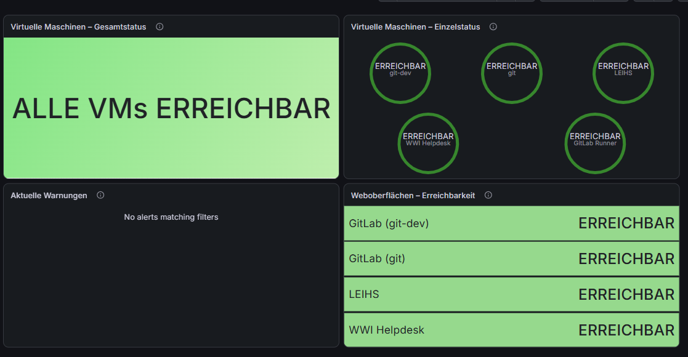
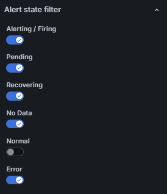

# Gesamtübersicht der virtuellen Maschinen

## 1. Ziel des Dashboards

Für den Monitor im IT-Labor wurde ein gemeinsames Grafana-Dashboard erstellt. Es zeigt die Erreichbarkeit der überwachten virtuellen Maschinen und Weboberflächen sowie aktuelle Warnungen.

Das Dashboard heißt „Gesamtstatus aller VMs“. Es enthält vier Panels und wird alle 30 Sekunden aktualisiert.

Detaillierte Informationen zu CPU, RAM, Festplatten und einzelnen Diensten bleiben in den vorhandenen Dashboards.

## 2. Aufbau

Die Panels sind in zwei Spalten angeordnet:

| Position | Panel | Darstellung |
| --- | --- | --- |
| Links oben | Virtuelle Maschinen – Gesamtstatus | Stat |
| Rechts oben | Virtuelle Maschinen – Einzelstatus | Gauge |
| Links unten | Aktuelle Warnungen | Alert list |
| Rechts unten | Weboberflächen – Erreichbarkeit | Stat |

Grün bedeutet, dass die jeweilige Erreichbarkeitsprüfung erfolgreich war. Rot zeigt eine fehlgeschlagene Prüfung.



## 3. Virtuelle Maschinen – Gesamtstatus

Dieses Panel fasst die Erreichbarkeit der Node Exporter zusammen.

Datenquelle: Prometheus

Abfrage:

```promql
min(up{job=~"node|leihs-node|wwihelpdesk-node|gitlab-runner-node|git-node"})
```

Der Abfragetyp ist „Instant“. Damit wird der aktuelle Wert abgefragt.

Die Werte werden als Text angezeigt:

| Wert | Text | Farbe |
| --- | --- | --- |
| 1 | ALLE VMs ERREICHBAR | Grün |
| 0 | MINDESTENS EINE VM NICHT ERREICHBAR | Rot |

Die Funktion `min()` liefert `0`, sobald mindestens eine der vorhandenen Zeitreihen den Wert `0` hat.

Wichtig: Eine vollständig fehlende Zeitreihe wird von dieser Abfrage nicht als `0` gezählt. Die Meldung setzt deshalb voraus, dass alle fünf Monitoring-Ziele weiterhin vorhanden sind.

## 4. Virtuelle Maschinen – Einzelstatus

Dieses Panel zeigt einen eigenen Kreis für jede VM:

- git-dev
- git
- LEIHS
- WWI Helpdesk
- GitLab Runner

Die Darstellung ist „Gauge“.

Abfrage:

```promql
label_replace(up{job="node"}, "vm", "git-dev", "job", ".*")
or label_replace(up{job="git-node"}, "vm", "git", "job", ".*")
or label_replace(up{job="leihs-node"}, "vm", "LEIHS", "job", ".*")
or label_replace(up{job="wwihelpdesk-node"}, "vm", "WWI Helpdesk", "job", ".*")
or label_replace(up{job="gitlab-runner-node"}, "vm", "GitLab Runner", "job", ".*")
```

Mit `label_replace()` bekommt jede Zeitreihe eine verständliche Bezeichnung im Label `vm`.

Einstellungen:

| Einstellung | Wert |
| --- | --- |
| Query type | Instant |
| Legend | `{{vm}}` |
| Min | 0 |
| Max | 1 |
| Thresholds mode | Absolute |
| Base | Rot |
| Schwellenwert 1 | Grün |
| Show thresholds | Aus |
| Gradient | Aus |

Value mappings:

- `1` → `ERREICHBAR`
- `0` → `NICHT ERREICHBAR`

„Erreichbar“ bedeutet hier: Prometheus kann die Metriken des Node Exporters abrufen. Das bestätigt nicht, dass alle Programme auf der VM fehlerfrei arbeiten.

## 5. Weboberflächen – Erreichbarkeit

Dieses Panel zeigt die Ergebnisse der HTTPS-Prüfungen durch den Blackbox Exporter.

Überwacht werden:

- GitLab auf git-dev
- GitLab auf git
- LEIHS
- WWI Helpdesk

Für GitLab Runner ist in diesem Panel keine Weboberfläche eingerichtet.

Abfrage:

```promql
label_replace(probe_success{job="gitlab-https"}, "vm", "GitLab (git-dev)", "job", ".*")
or label_replace(probe_success{job="git-https"}, "vm", "GitLab (git)", "job", ".*")
or label_replace(probe_success{job="leihs-https"}, "vm", "LEIHS", "job", ".*")
or label_replace(probe_success{job="wwihelpdesk-https"}, "vm", "WWI Helpdesk", "job", ".*")
```

Einstellungen:

- Darstellung: Stat
- Query type: Instant
- Legend: `{{vm}}`
- Color mode: Background Solid
- Wert `1`: ERREICHBAR, grüner Hintergrund
- Wert `0`: NICHT ERREICHBAR, roter Hintergrund

Die Prüfung erfolgt vom zentralen Monitoring-Server aus. `probe_success = 1` bedeutet, dass die Prüfung nach den Einstellungen des jeweiligen Blackbox-Moduls erfolgreich war.

Die rechteckigen Statusfelder unterscheiden sich optisch von den Kreisen für die VMs.

## 6. Aktuelle Warnungen

Für dieses Panel wurde die eingebaute Darstellung „Alert list“ verwendet. Eine PromQL-Abfrage ist dafür nicht erforderlich.

Das Panel verwendet die bereits vorhandenen Alert-Regeln. Es wurden dafür keine neuen Regeln erstellt.

Einstellungen:

| Einstellung | Wert |
| --- | --- |
| View mode | List |
| Group mode | Default grouping |
| Max items | 20 |
| Sort order | Importance |
| Alerts linked to this dashboard | Aus |

Die Filter für Alert name, Alert instance label, Datasource und Folder bleiben leer. Dadurch wird die Liste nicht auf eine bestimmte VM oder einen bestimmten Ordner begrenzt.

Die Zustandsfilter sind wie folgt eingestellt:

| Zustand | Anzeigen |
| --- | --- |
| Alerting / Firing | Ja |
| Pending | Ja |
| Recovering | Ja |
| No Data | Ja |
| Error | Ja |
| Normal | Nein |

Damit werden auch fehlende Daten und Fehler bei der Auswertung sichtbar. Regeln im normalen Zustand werden ausgeblendet.

„Importance“ sortiert nach dem Alert-Zustand. Dies ist keine Sortierung nach dem eigenen Label `severity`.



Die Meldung „No alerts matching filters“ bedeutet, dass aktuell keine Alarme zu den ausgewählten Filtern passen. Sie ist keine vollständige Bestätigung, dass alle Systeme fehlerfrei sind.

## 7. Automatische Aktualisierung

Im Menü neben „Refresh“ wurde das Intervall `30s` gewählt. Danach wurde das Dashboard gespeichert.

Die Anzeige wird dadurch regelmäßig aktualisiert und muss nicht manuell neu geladen werden.

## 8. Ergebnis und Grenzen

Das Dashboard bietet eine kompakte Übersicht für den Laborbetrieb:

- Der Gesamtstatus zeigt die zusammengefasste Erreichbarkeit.
- Die einzelnen Gauge-Anzeigen zeigen die betroffene VM.
- Die HTTPS-Anzeigen zeigen den Zustand der Weboberflächen.
- Die Warnungsliste ergänzt Probleme aus den bestehenden Alert-Regeln.

Bei der Einrichtung waren alle fünf Node Exporter erreichbar. Die vier HTTPS-Prüfungen waren ebenfalls erfolgreich. Die Warnungsliste zeigte keine passenden Alarme.

Für diese Übersicht wurde kein zusätzlicher Ausfalltest durchgeführt.

Das Dashboard hängt vom zentralen Monitoring-System ab. Wenn Grafana, Prometheus oder der Monitoring-Server ausfallen, kann die Anzeige fehlen oder nicht mehr aktuell sein. Fehlende Daten dürfen deshalb nicht als erfolgreicher Zustand verstanden werden.